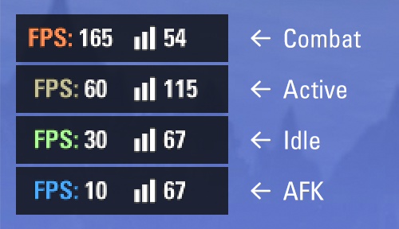
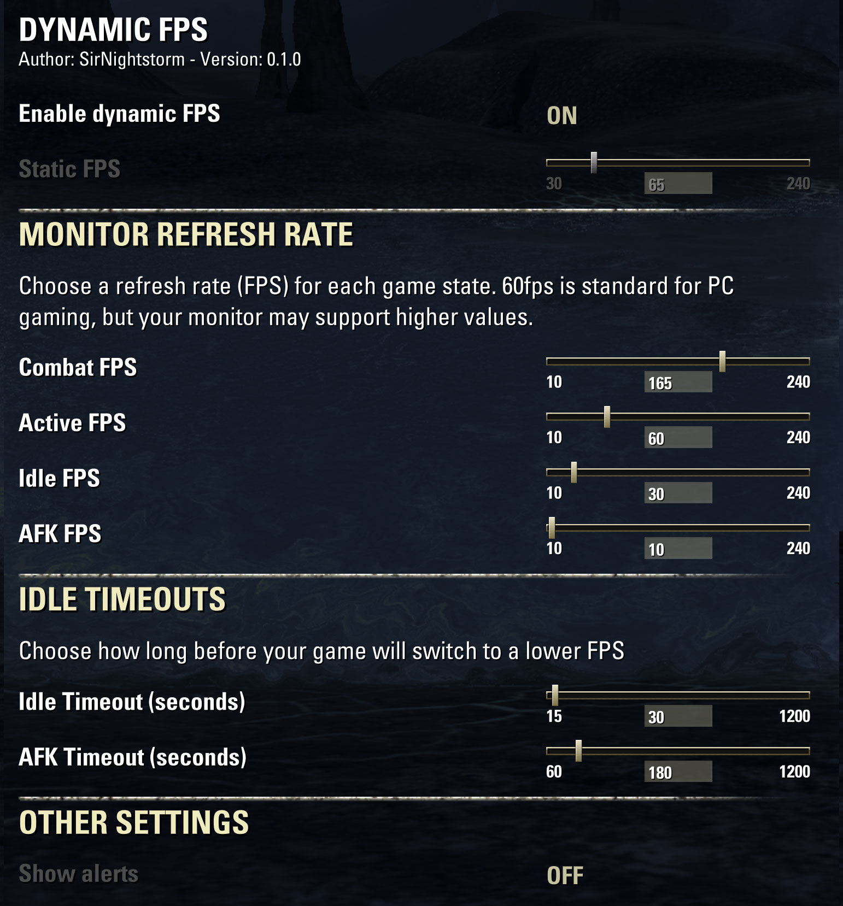

# Dynamic FPS - an ESO AddOn #
This is a small, lightweight AddOn that will vary your game's monitor refresh rate (often called
FPS - frames per second), primarily to save power and reduce heat generation when you are idle, but also
to maximise the refresh rate when you are in combat.

## Please Note ##

This AddOn is brand-new, and has only been tested by me! **Please don't use this AddOn if you're not
comfortable fixing your MinFrameRate (below) if things go wrong!** I would appreciate friendly feedback as to how
it can be improved or how it isn't working the way you'd expect.

The ability to change your monitor's refresh rate depends on the capabilities of your monitor, your
graphics card, Windows and ESO itself! If you find that the FPS doesn't change when the game is idle,
I'm afraid you'll have to find guides on the internet - I hope to add some links to these at some point.

The AddOn will always try and restore the game's refresh rate to the Fixed FPS setting before you log out
or quit the game. If this doesn't happen and you disable the AddOn your game may get stuck with the last
FPS that the AddOn used! In that case, re-enable Dynamic FPS, go into Settings and turn 'Dynamic FPS' off,
before re-disabling the AddOn. You can also
[fix the MinFrameTime setting in UserSettings.txt manually](https://forums.elderscrollsonline.com/en/discussion/584759/frame-rate-cap-adjustment-how-to-limit-your-fps-from-being-too-high-updated).

## Features ##

- Four FPS settings for different game states
- Configurable timeouts for idle and AFK modes
- Colour the FPS counter to show Dynamic FPS's current state
- Show in the top-right corner of the screen when Dynamic FPS changes states

## Required Libraries ##

- LibAddonMenu-2.0

## Settings ##

- **Enable dynamic FPS**: The AddOn starts in a disabled state; switch this ON to enable management of
the game's maximum FPS
- **Static FPS**: When dynamic FPS is OFF, the AddOn will set the maximum FPS to this value. ESO's default
is 100fps; 60fps is common for PC games

### Monitor Refresh Rate ###

This is where you set the maximum FPS for each of the states that the AddOn detects.

- **Combat FPS**: when your character is in combat you can choose to increase the game's FPS to your
monitor's maximum FPS, or choose the highest setting that your graphics card can consistently run at
- **Active FPS**: this is the standard FPS for general adventuring. 60fps is a good choice for this
- **Idle FPS**: after you haven't moved your character or camera for some time, you can reduce the FPS.
30fps is the default, which reduces power and heat but is relatively smooth
- **AFK FPS**: once you have been idle for a significant time you can reduce the FPS further. 10fps
will make the game look 'choppy', but should significantly reduce energy and heat

### Other Settings ###

- **Show alerts** - If you want to make it more obvious when the AddOn changes state, this will post
an update to the top-right of the screen

## Chat Box 'Slash' Commands ##

You can use the following commands:
- `/dfps` - Open Dynamic FPS Settings
- `/dfps on` - Enable Dynamic FPS
- `/dfps off` - Disable Dynamic FPS - this will use the 'Fixed FPS' instead

## Disclaimer ##

This Add-on is not created by, affiliated with or sponsored by ZeniMax Media Inc. or its affiliates.
The Elder Scrolls® and related logos are registered trademarks or trademarks of ZeniMax Media Inc.
in the United States and/or other countries. All rights reserved.
